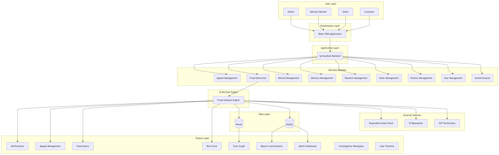
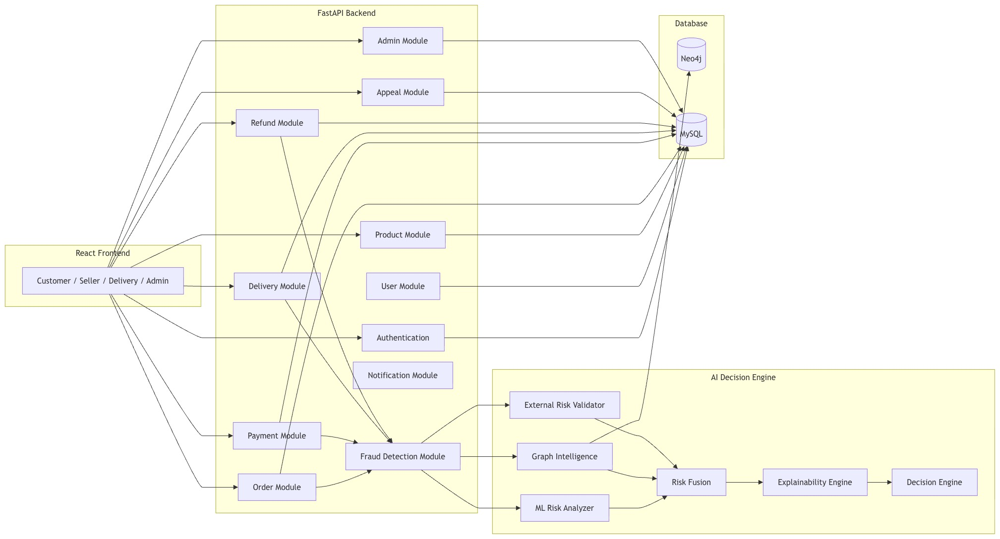
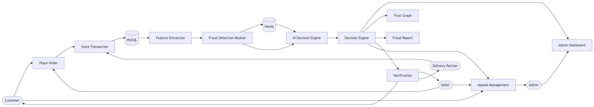
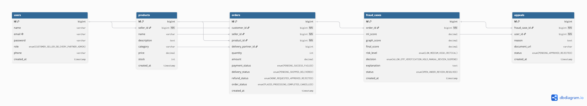
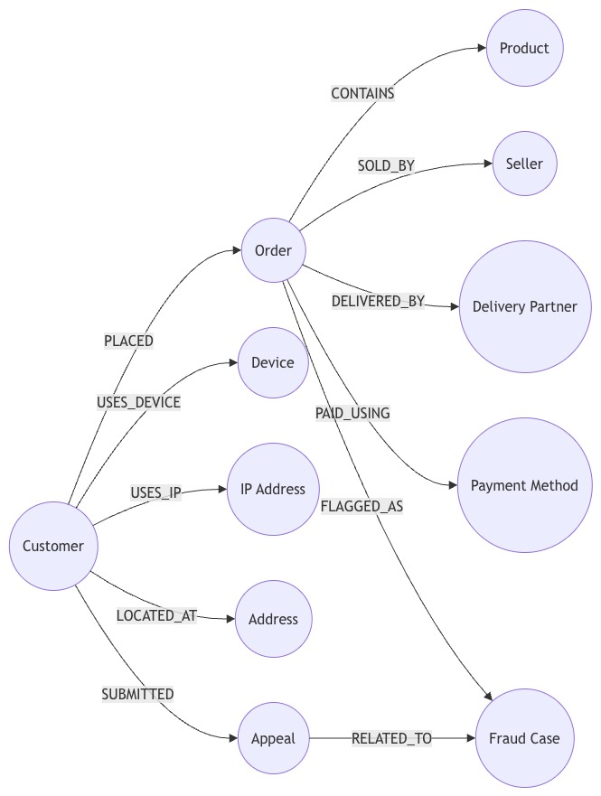
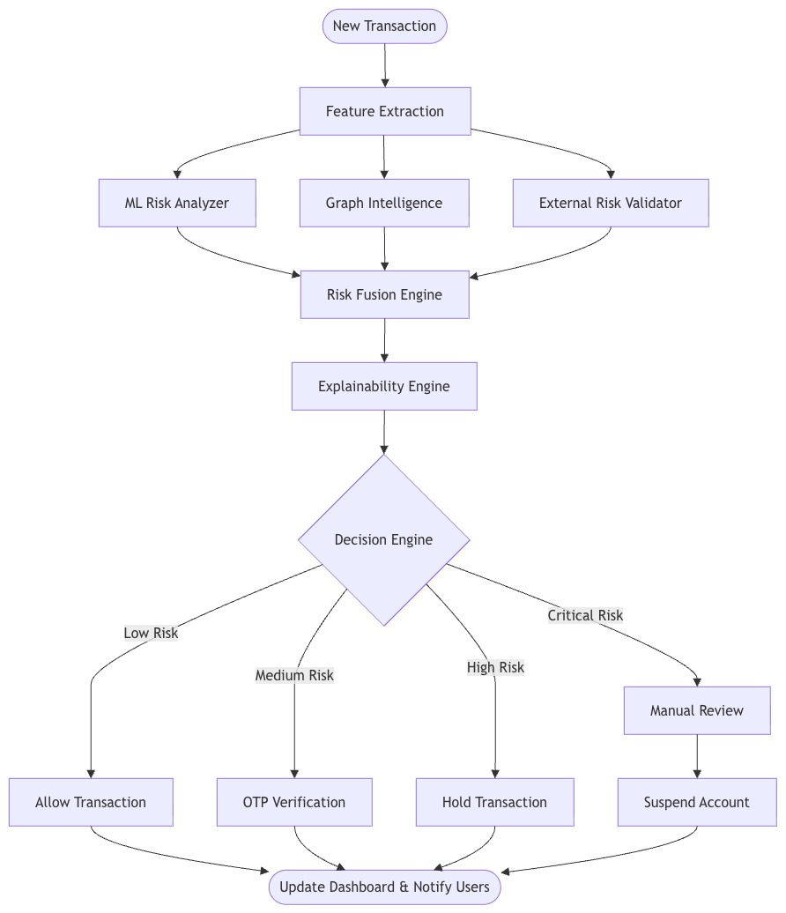
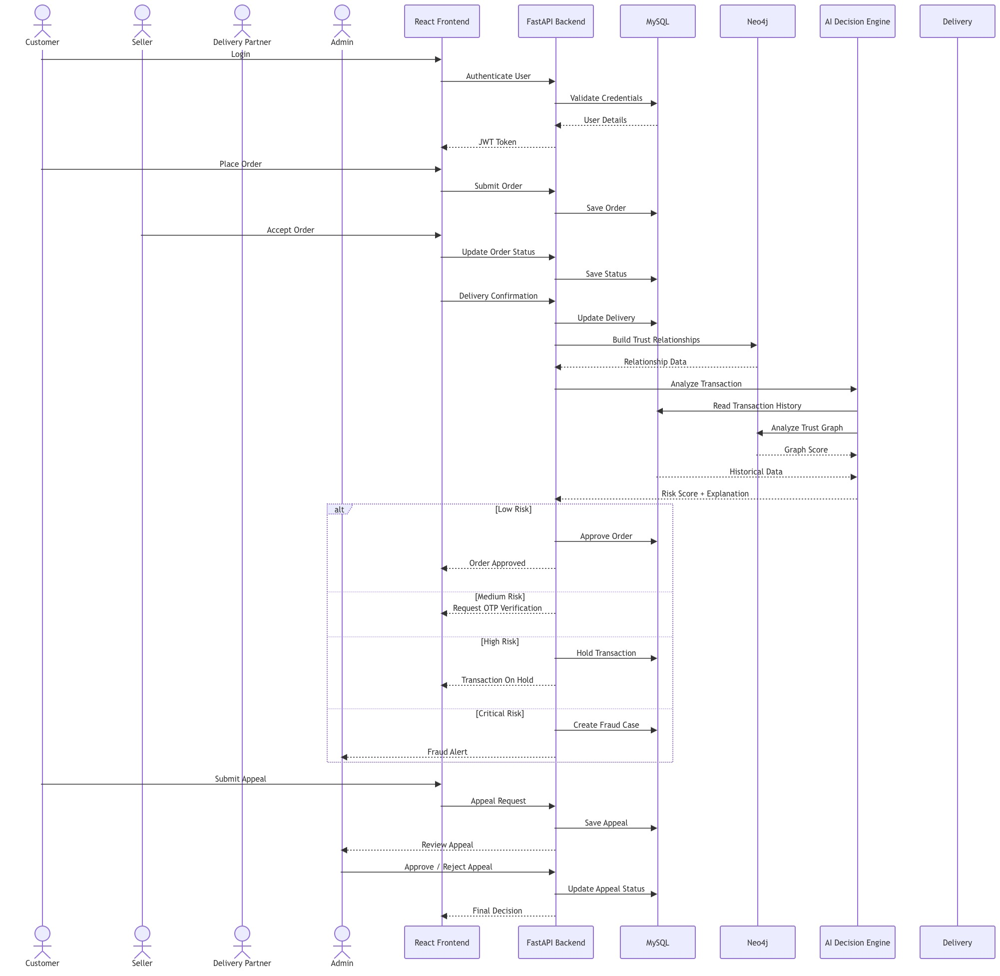

<div align="center">

# 🛡️ AI-Powered Trust Graph Platform
### Multi-Actor Fraud Detection & Remediation System

An intelligent fraud detection platform that combines **Spring Boot**, **React**, **MySQL**, **Neo4j**, **Machine Learning**, and **Explainable AI** to detect coordinated fraud and collusion in e-commerce ecosystems.


</div>

---

# 📌 Project Overview

AI-Powered Trust Graph Platform is an e-commerce fraud detection and trust-analysis system designed to identify suspicious activity across customers, sellers, delivery partners, devices, and IP addresses.

The backend is a **Spring Boot** application that provides REST APIs for authentication, product management, order processing, fraud-case review, trust-graph synchronization, and analytics. The frontend is a **React + Vite** application.

The system persists transactional data in **MySQL** and models relationships in **Neo4j** to support graph-based trust analysis. When an order is placed, the platform also sends the order to an external AI prediction service and stores the resulting fraud case for later review.

---

# 🎯 Problem Statement

Modern e-commerce platforms are increasingly affected by sophisticated fraud schemes involving multiple participants working together to exploit refund policies, fake deliveries, account sharing, and device/IP reuse.

This project aims to provide a fraud detection platform that:
- authenticates users securely,
- enforces role-based access control,
- evaluates orders with an external AI service,
- records fraud decisions,
- builds a trust graph to uncover collusion patterns,
- and surfaces analytics for different user roles.

---

# ✨ Key Features

Implemented in the inspected code:

- JWT-based authentication
- Role-based authorization for `CUSTOMER`, `SELLER`, `DELIVERY_PARTNER`, and `ADMIN`
- User registration and login
- User profile management
- Product CRUD for sellers/admins
- Order creation for customers
- Delivery partner assignment by admins
- Order status updates with role checks
- Asynchronous AI fraud evaluation
- Fraud case persistence and retrieval
- Neo4j trust-graph synchronization
- Graph statistics endpoint
- Role-aware analytics dashboard data

Not confirmed from the code inspected:
- refunds workflow
- appeal management
- notification delivery
- email sending
- report export/download

---

# 🛠️ Technology Stack

| Category | Technology |
|-----------|------------|
| Backend | Spring Boot |
| Programming Language | Java 21 |
| Frontend | React + Vite |
| Relational Database | MySQL |
| Graph Database | Neo4j |
| Authentication | JWT |
| Persistence | Spring Data JPA, Spring Data Neo4j |
| Validation | Spring Validation |
| Security | Spring Security |
| Build Tool | Maven |
| Frontend Build Tool | Vite |
| HTTP Client | RestTemplate |
| Serialization / DTOs | Lombok |

---

# 🏗️ System Design

The platform follows a layered architecture:

1. **Presentation layer** – REST controllers and React frontend
2. **Business layer** – services that enforce business rules
3. **Persistence layer** – JPA repositories and Neo4j repositories
4. **Security layer** – JWT authentication and authorization
5. **External integration layer** – AI fraud scoring service

## High-Level Architecture

The repository includes architecture diagrams in `docs/`:

<p align="center">
    
</p>

## Component Diagram

<p align="center">
    
</p>

## Data Flow Diagram

<p align="center">
    
</p>

## Database Design (ER Diagram)

<p align="center">
    
</p>

## Trust Graph Model

<p align="center">
    
</p>

## AI Decision Workflow

<p align="center">
    
</p>

## End-to-End Workflow

<p align="center">
    
</p>

---

# 📁 Repository Structure

```text
AIPoweredTrustGraph/
├── README.md
├── backend/
│   ├── pom.xml
│   └── src/main/
│       ├── java/com/example/backend/
│       │   ├── BackendApplication.java
│       │   ├── controller/
│       │   ├── dto/
│       │   ├── entity/
│       │   ├── exception/
│       │   ├── graphrepository/
│       │   ├── node/
│       │   ├── repository/
│       │   ├── security/
│       │   └── service/
│       └── resources/
│           └── application.properties
├── frontend/
│   └── frontend/
│       ├── package.json
│       ├── index.html
│       └── src/
└── docs/
```

---

# ⚙️ Backend Setup

## Prerequisites
- Java 21
- Maven
- MySQL
- Neo4j
- External AI prediction service

## Run the backend

```bash
cd backend
mvn spring-boot:run
```

## Build the backend

```bash
cd backend
mvn clean install
```

## Backend configuration

The backend configuration is stored in:
- `backend/src/main/resources/application.properties`

Observed values in code:
- server port: `8081`
- MySQL datasource configured for `aihackthonproject`
- Neo4j configured on `bolt://localhost:7687`
- JWT secret and expiration configured in properties
- AI service URL configured as `http://10.142.0.145:8000/predict`

### Important note
Several sensitive values are currently hardcoded in `application.properties`. For production use, they should be moved to environment variables or a secrets manager.

---

# 🌐 Frontend Setup

The frontend is located in `frontend/frontend/`.

## Install dependencies

```bash
cd frontend/frontend
npm install
```

## Start development server

```bash
npm run dev
```

## Build for production

```bash
npm run build
```

## Preview production build

```bash
npm run preview
```

## Lint the frontend

```bash
npm run lint
```

---

# 🔐 Authentication and Authorization

The application uses JWT-based authentication.

## Flow
1. User registers or logs in through `/api/auth/*`
2. Backend authenticates credentials and generates a JWT
3. The client sends the JWT in the `Authorization: Bearer <token>` header
4. `JwtAuthFilter` validates the token on each request
5. Spring Security grants access based on role

## Roles
- `CUSTOMER`
- `SELLER`
- `DELIVERY_PARTNER`
- `ADMIN`

## Security Notes
- Sessions are stateless
- CORS is enabled for development with wildcard origins
- CSRF is disabled for the stateless API

---

# 🧩 Core Backend Modules

## Auth Module
Files:
- `AuthController`
- `AuthService`
- `JwtUtils`
- `JwtAuthFilter`
- `CustomUserDetails`
- `CustomUserDetailsService`

Responsibilities:
- register users
- authenticate logins
- issue JWTs
- map users to Spring Security principals

## User Module
Files:
- `UserController`
- `UserService`
- `UserRepository`
- `UserDto`

Responsibilities:
- profile retrieval and updates
- admin user listing
- toggling user active status

## Product Module
Files:
- `ProductController`
- `ProductService`
- `ProductRepository`
- `ProductDto`
- `ProductRequest`

Responsibilities:
- product CRUD
- seller-specific product listing
- ownership checks for updates/deletes

## Order Module
Files:
- `OrderController`
- `OrderService`
- `OrderRepository`
- `OrderDto`
- `OrderRequest`

Responsibilities:
- order placement
- role-based order visibility
- delivery assignment
- status updates
- asynchronous fraud evaluation and graph sync

## Fraud Detection Module
Files:
- `FraudCaseController`
- `FraudDetectionService`
- `FraudCaseRepository`
- `FraudCaseDto`

Responsibilities:
- send orders to external AI service
- save fraud results
- expose fraud-case data for authorized users

## Trust Graph Module
Files:
- `GraphController`
- `TrustGraphService`
- Neo4j node/repository classes

Responsibilities:
- synchronize order-related relationships into Neo4j
- provide graph statistics

## Analytics Module
Files:
- `AnalyticsController`
- `AnalyticsService`
- `AnalyticsDto`

Responsibilities:
- compute admin, seller, and customer analytics

---

# 🗃️ Database Model

## MySQL entities

### User
Stores application users, roles, contact info, and status.

### Product
Stores product catalog data and seller ownership.

### Order
Stores customer orders, seller linkage, delivery partner assignment, AI tracking metadata, and status.

### FraudCase
Stores AI fraud evaluation results for an order.

## Neo4j graph model

Observed graph node types:
- `GraphUser`
- `GraphOrder`
- `GraphDevice`
- `GraphIpAddress`

Observed relationships:
- customer `PLACED` order
- customer `USES_DEVICE`
- customer `USES_IP`
- order associated with seller through graph modeling

---

# 🔄 Business Workflow Summary

## Register/Login
- users register with a role
- login returns JWT
- authenticated requests use the token

## Product lifecycle
- sellers/admins create products
- sellers/admins update or delete their own products
- admins can manage all products

## Order lifecycle
- customers create an order
- stock is decremented immediately
- order starts in `PENDING`
- AI fraud evaluation and graph sync run asynchronously
- admins can assign delivery partners
- delivery partners can mark assigned orders as delivered

## Fraud workflow
- each order is sent to the AI service
- response is saved as a fraud case
- fraud cases can be queried by admin, seller, or by order access rules

## Analytics workflow
- metrics are computed dynamically from persisted data
- output varies by user role

---

# 📡 API Endpoints

## Auth
- `POST /api/auth/register`
- `POST /api/auth/login`

## Users
- `GET /api/users/profile`
- `PUT /api/users/profile`
- `GET /api/users` — admin only
- `PUT /api/users/{id}/status` — admin only

## Products
- `GET /api/products`
- `GET /api/products/{id}`
- `GET /api/products/seller`
- `POST /api/products`
- `PUT /api/products/{id}`
- `DELETE /api/products/{id}`

## Orders
- `POST /api/orders`
- `GET /api/orders/my-orders`
- `GET /api/orders/unassigned`
- `PUT /api/orders/{id}/assign/{dpId}`
- `PUT /api/orders/{id}/status`

## Fraud Cases
- `GET /api/fraud-cases`
- `GET /api/fraud-cases/seller`
- `GET /api/fraud-cases/order/{orderId}`

## Graph
- `GET /api/graph/stats`

## Analytics
- `GET /api/analytics`

---

# 🧪 Testing

No test classes were inspected in the repository contents reviewed.

What is visible:
- test dependencies are present in `pom.xml`

What is not determinable from the inspected code:
- actual unit tests
- integration tests
- coverage
- CI workflows

---

# 🚨 Error Handling

Observed error handling patterns:
- `ResourceNotFoundException` for missing data
- `CustomException` for business-rule violations
- AI service failure logging in `FraudDetectionService`
- Neo4j sync failure logging in `TrustGraphService`

A centralized exception handler was not inspected, so the exact error response structure is not known from the available code.

---

# 🧠 Design Decisions

Observed design choices in the code:
- modular monolith structure
- DTOs used for API responses
- stateless JWT security
- asynchronous fraud evaluation and graph sync
- separation between relational and graph data stores
- role-aware analytics and authorization
- demo-safe graph stats fallback when Neo4j is empty/unavailable

---

# 📎 Notes for New Developers

- Order creation has side effects; it is not just a database insert.
- The AI fraud service is external and may fail independently of the core backend.
- Security checks occur both at the controller level (`@PreAuthorize`) and service level.
- `application.properties` contains sensitive values and should be reviewed before any non-local deployment.
- The frontend source files were not fully inspected here, so UI behavior should be confirmed by reading `frontend/frontend/src/`.

---

# ✅ Summary

`AIPoweredTrustGraph` is a Spring Boot and React-based fraud detection platform that combines relational data, graph modeling, and AI scoring to detect suspicious e-commerce activity. The backend is organized around authentication, product/order management, fraud analysis, trust-graph synchronization, and analytics, with role-based security throughout.
